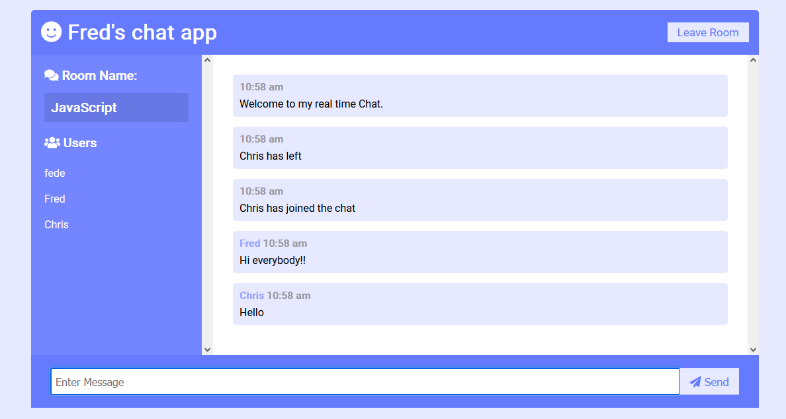

# Fred's realtime chat app 2.0

Second chat app I made to practice WebSocket protocol, This time I didn't use React or any other js framework. I used plain javascript, html and css. This one has the rooms already preset and it displays the user names that are connected to the current room, you just have to choose one and join to chat. I passed the instanciated socketio variable using a script tag in the html main file. It also has CORS set up to accept connections only from the deployed web itself. It is deployed to Heroku.  
Deployed App: <a href="https://fredschatapp.herokuapp.com/">Fred's realtime chat app 2.0</a>

